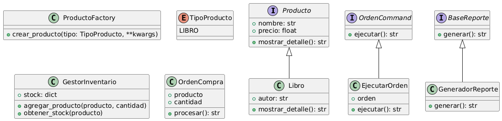

# Proyecto final de modulo 5

# Instrucciones para instalar y ejecutar el proyecto

Este proyecto está hecho con Python 3.11 y Django 5.2. Usé Miniconda para manejar el entorno virtual porque me pareció la forma más práctica y compatible con cualquier sistema.

## 1. Clonar el repositorio

```bash
git clone https://github.com/AlanCornejoQ/backend-tienda.git
cd backend-tienda
```
## 2. Crear el entorno con Conda
Ya dejé preparado un archivo environment.yml, así que con estos comandos se puede crear el entorno fácilmente:
```bash
conda env create -f environment.yml
conda activate tienda-backend
```

## 3. Aplicar migraciones
Esto es necesario para que Django cree las tablas iniciales en la base de datos:
```bash
python manage.py migrate
```

## 4. Probar que todo funciona
Se pueden ejecutar los siguientes archivos para verificar los módulos desarrollados:
```bash
python tests/test_productos.py
python tests/test_inventario.py
python tests/test_ordenes.py
python tests/test_notificaciones.py
```
--- 
# Patrones de diseño aplicados

En este proyecto se implementaron varios patrones de diseño para estructurar el backend de una tienda en línea. El objetivo fue mantener el código limpio, modular y fácil de extender. 

---

## Patrones creacionales

### Factory Method
- **Archivo:** `productos/factory.py`
- **Uso:** Se usa para crear diferentes tipos de productos sin acoplar la lógica de creación a otras partes del sistema.
- **Motivo:** Permite agregar nuevos tipos de productos sin modificar el código ya existente.

### Singleton
- **Archivo:** `inventario/gestor.py`
- **Uso:** Se usa para que el inventario sea una única instancia compartida.
- **Motivo:** Evita tener múltiples instancias y mantiene la coherencia en la gestión de stock.

---

## Patrones estructurales

### Decorator
- **Archivo:** `reportes/base.py`, `reportes/generador.py`
- **Uso:** Se aplica para extender el comportamiento de los reportes sin modificar las clases base.
- **Motivo:** Se puede generar, por ejemplo, una salida en formato CSV sin tocar la clase original del reporte.

---

## Patrones de comportamiento

### Command
- **Archivo:** `ordenes/comandos.py`
- **Uso:** Encapsula una orden como objeto.
- **Motivo:** Se separa quien solicita la orden de quien la ejecuta, facilitando futuras extensiones.

### Observer
- **Archivo:** `notificaciones/observer.py`
- **Uso:** Permite registrar observadores que reaccionan cuando se procesa una orden.
- **Motivo:** Agrega flexibilidad y desacopla la lógica de notificaciones del resto del sistema.

---

## Principios de diseño seguidos

- **SOLID:** Cada clase tiene una única responsabilidad, está bien separada y permite extender sin modificar.
- **KISS:** El código se mantiene lo más simple posible.
- **DRY:** Se evitó repetir lógica innecesaria.
- **YAGNI:** Solo se implementó lo necesario para el funcionamiento actual del sistema.

---
## Diagrama del Sistema


## Nota sobre archivos generados automáticamente

Dado que uso Django como framework principal, hay varios archivos que fueron generados automáticamente al crear el proyecto y las apps (como `admin.py`, `apps.py`, `views.py`, `migrations/`, entre otros). Estos archivos no fueron modificados si no eran necesarios para la implementación de los patrones, pero se mantuvieron como parte de la estructura recomendada por Django

